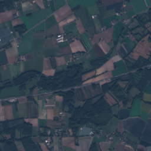
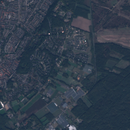
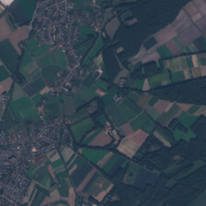
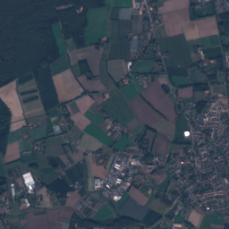
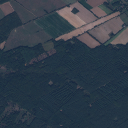
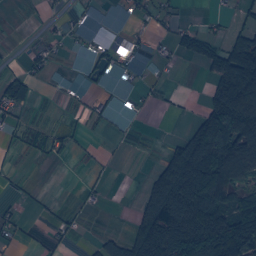
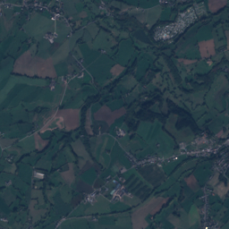

# SATquery AI — consolidated evidence handoff

Read README.md for snapshot scope. Relative asset paths assume the ppt_handoff root.

# Current status — evidence snapshot, 6 September 2026

## Implemented and verified within stated scope
- Original local VQA: real pinned checkpoint; demonstrated image-question inference. Accuracy is limited.
- LoRA training execution and adapter reload: saved 720-step pilot, 544768 trainable parameters.
- Evaluation page: displays stored original diagnostic and separate development comparison, not live evaluation.
- Corrected NDVI: real red/NIR arithmetic; independent decoder/scalar verification agrees on all mask pixels for one scene.
- NDVI overlay: toggle, shared image transform, projected area and result/raster exports.
- Supported GeoTIFF ingestion: labelled RGB bands, original raster retention, CRS/affine/bounds/resolution metadata.
- Input tests: malformed, oversized, missing-NIR, zero denominator and nodata-heavy cases exercised.

## Implemented but not fully validated
- General GeoTIFF support: supported crop contract only; user-supplied reflectance tags are trusted, not independently authenticated.
- General projected area: determinant calculation, metre-based projected CRS. No terrain correction; geographic CRS gets no area.
- Run details: useful measurements/model IDs, not a full orchestrator trace. NDVI trace lacks a general tool registry.
- General input guardrails: keyword refusal exists but misses “Compare this to last year”; routed to VQA during failure testing.
- Pan/zoom alignment: visual/implementation checks, not a GIS registration benchmark.
- Local runtime: functional prototype, no timeout/cancel/recovery robustness guarantee.

## Experimental
- Adapted VQA: 23/60 to 47/60 on development, format failures 20 to 0. Not final held-out performance.
- Semantic improvement is against published labels; there is no independently annotated visual validation set.

## Planned / not implemented
Natural-language tool routing; text-guided grounding; temporal/change VQA; optical-SAR fusion; calibrated confidence; automatic source retrieval; arbitrary AOI/polygon analysis; full processing-stage viewer; final held-out adapter evaluation; fallback recording; final deck.
NDVI threshold masks are not text-guided grounding.
No React, hosted inference API, autonomous multi-agent backend or BigEarthNet training was added.

This is an internal prototype, not completion of the full SIH problem statement.

---

# Technology and rationale

| Layer | Exact implementation | Why |
|---|---|---|
| Frontend | HTML, CSS, vanilla JavaScript; no Node runtime/build | Small local app; image pan/zoom and theme control without a framework |
| Backend | FastAPI 0.115.12; Uvicorn 0.34.2 | Local HTTP uploads, jobs and artifact endpoints |
| VLM | AdaptLLM/remote-sensing-Qwen2-VL-2B-Instruct, revision 7f5dd71bf0f40c282193d50160e848a387a08ffe | Existing RS adaptation; measured fit on this laptop, not proven best checkpoint |
| Training | Torch 2.8.0+cu128; Transformers 4.51.3; Accelerate 1.6.0 | Existing GPU inference and training stack |
| Adaptation | PEFT 0.15.2; LoRA r4/alpha8/dropout0.05, q_proj/v_proj | Train a small adapter while freezing base weights |
| Raster | Rasterio 1.4.4 / GDAL 3.10.3 | GeoTIFF, masks, geotransforms and raster output |
| NDVI | NumPy 2.4.6 | Deterministic CPU band arithmetic |
| CRS | pyproj 3.7.2 | CRS interpretation and coordinate transformation |
| Images | Pillow 12.3.0 | RGB previews, upload decode, overlay PNG |
| Independent check | tifffile 2026.3.3 + scalar Python | Separate decoder/calculation for verification |
| Evaluation | Custom exact-label scorer in scripts/train_pilot.py | Auditable scoring; no LLM judge |
| Runtime | Python 3.11.16 in WSL2 Ubuntu; Torch CUDA build 12.8 | Local execution |

Checkpoint stored tensor elements: 2442359296 (marketed 2B family; tensor-storage count, not a separately loaded deduplicated parameter audit). LoRA trainable: 544768. Node is not used; no WSL Node installed. Full machine/version dump: metrics/system.json.

---

# Model lineage and ownership
Qwen2-VL-2B → Qwen2-VL-2B-Instruct → AdaptLLM remote-sensing-Qwen2-VL-2B-Instruct → our lora-pilot-v1 adapter.

The starting checkpoint already contains remote-sensing post-training. We did not create Qwen's architecture, its pretraining, the upstream RS adaptation, LoRA, RSVQA or NDVI. The upstream model card describes its ancestry and links its RS instruction data: https://huggingface.co/AdaptLLM/remote-sensing-Qwen2-VL-2B-Instruct .

Our work: select/pin the checkpoint; construct a documented RSVQA-LR subset and source-scene-separated development split; train the adapter; measure paired development outputs; implement the local app and deterministic geospatial workflow; audit/calibrate the sample and independently reproduce its measurement.

We trained LoRA matrices attached to q_proj and v_proj, rank 4, 544768 trainable parameters. The original model weights remain frozen. No full-model finetune and no new foundation model.

Training inputs: RGB images with Qwen chat templates and restricted answer-label suffixes; assistant-answer-only loss. Inference loads pinned base, then PEFT adapter when selected. Baseline uses disable_adapter() after an adapter has been attached. Pilot modes use 64–128 visual tokens and max 16 output tokens; general baseline UI uses 256–512 and max 128, so those UI modes are not an apples-to-apples benchmark.

---

# Training dossier
Source: RSVQA LR v1.0, DOI 10.5281/zenodo.6344334, CC-BY-4.0 (Zenodo API checked). Published OSM-derived labels, not our manual annotations.
720 training Q&A / 120 images, six source scenes. 60 development Q&A / 20 images, one different source scene. Source images 256 x 256 RGB; TIFF-to-PNG RGB conversion; processor dynamically resizes into 64–128 visual-token bounds.
Categories: rural/urban 120 train, presence 240, comparison 360; dev 20 each.
Selection seed 26167; sample order shuffled once, then traversed once. Exact rows/hashes: raw/train.jsonl, raw/dev.jsonl, raw/learning_manifest.json.
Training/dev source scenes disjoint; official diagnostic test scene excluded; image hashes checked. This does not rule out adjacency or upstream checkpoint contamination.

One epoch/pass, 720 optimizer steps, batch 1, accumulation 1, effective batch 1.
AdamW, LR 0.0001, default betas (0.9,0.999), eps 1e-8, weight decay 0.01; no scheduler or warmup.
LoRA rank4 alpha8 dropout0.05, q_proj/v_proj, bias none; 544768 trainable.
BF16; SDPA; non-reentrant gradient checkpointing; clip grad norm 1; answer-only loss; no quantization.
GPU: RTX 5060 Laptop 8GB. Peak allocated recorded 4.454 GiB.
Recorded seconds: 190.024. IMPORTANT: timer starts before training and ends after adapted dev evaluation and save; it is NOT isolated training time. Baseline dev evaluation and reload are outside it.
First loss 0.84840059; final 0.00280530. Different examples: this endpoint difference is not a controlled loss improvement metric. See all 720 values and moving-average curve.
Saved: final adapter and processor; no per-epoch/intermediate checkpoint archive. Reload succeeded.
Historical training-running/terminal screenshots were not saved. We provide raw logged values and honestly labelled plots, not reconstructed terminal screenshots.

---

# Development evaluation, not final benchmark
| Category | Original | Adapter | Development majority |
|---|---:|---:|---:|
| Rural/urban | 0/20 | 15/20 | 11/20 urban |
| Presence | 10/20 | 15/20 | 16/20 yes |
| Comparison | 13/20 | 17/20 | 10/20 either |
| Total | 23/60 | 47/60 | 37/60 |

Original 38.33%, adapter 78.33%, majority 61.67%. The majority is a descriptive baseline computed from development labels, not a model selected without observing development labels.
Same prompts, RGB processor, 64–128 visual tokens, deterministic max16 output tokens. Normalize lower-case/whitespace, remove trailing space .!? characters, require exact reference equality. Invalid formatting counts wrong.
20 original format failures, zero adapted. Pair transitions: 11 valid-format wrong-label → correct-label, 15 invalid-format → correct-label, 2 regressions, 32 unchanged correctness.
Do not claim all 24 net gains prove better visual reasoning. All 20 rural/urban original outputs were format-invalid; some already named the correct class. The adapter underperforms the majority baseline on presence.
60 questions share only 20 images; samples are correlated and from one dev scene. Published labels may be noisy, upstream exposure unknown, no independent hand-label audit or statistical generalization claim.
Exact predictions: raw/*predictions.jsonl and metrics/all_prediction_comparisons.csv.

## Frozen diagnostic / final test
Earlier original-model diagnostic: 24/60 (40%), presence10/20, comparison14/20, rural0/20; 20 format failures. This uses a DIFFERENT 60-image set and must not be paired with 47/60.
It has already been inspected, so is not a fresh final test. No final held-out adapter test is available in this handoff; freeze configuration and reserve a fresh final split before running it.

---

# Real development examples

These are cherry-picked explanatory examples, not an unbiased evaluation. “Correct” means agreement with published reference labels, not independent visual truth.
## Q4889 — semantic-label gain

Question: Are there less roads than residential buildings?

Reference: yes

Original: No

Adapter: yes

Original and adapter both use valid labels; adapter now matches the published label. This is not merely formatting.

## Q1210 — semantic-label gain

Question: Is a commercial building present?

Reference: yes

Original: No

Adapter: yes

Original and adapter both use valid labels; adapter now matches the published label. This is not merely formatting.

## Q4440 — semantic-label gain

Question: Are there less farmlands than buildings?

Reference: yes

Original: No

Adapter: yes

Original and adapter both use valid labels; adapter now matches the published label. This is not merely formatting.

## Q2522 — semantic-label gain

Question: Is there a forest?

Reference: yes

Original: No

Adapter: yes

Original and adapter both use valid labels; adapter now matches the published label. This is not merely formatting.

## Q1495 — semantic-label gain

Question: Is there a wetland?

Reference: yes

Original: No

Adapter: yes

Original and adapter both use valid labels; adapter now matches the published label. This is not merely formatting.

## Q5440 — regression

Question: Is there a circular road?

Reference: no

Original: No

Adapter: yes

Original matches the reference; adapter changes to the wrong label.

## Q1936 — regression

Question: Is there a rectangular grass area?

Reference: no

Original: No

Adapter: yes

Original matches the reference; adapter changes to the wrong label.

## Q1400 — format-confounded gain

Question: Is it a rural or an urban area

Reference: rural

Original: The image depicts a rural area. This is evident from the presence of large,

Adapter: rural

Original violates the exact-label protocol. Inspect its wording before attributing this to semantic improvement.

## Q1200 — format-confounded gain

Question: Is it a rural or an urban area

Reference: urban

Original: The area depicted in the image is a rural setting. This is indicated by the

Adapter: urban

Original violates the exact-label protocol. Inspect its wording before attributing this to semantic improvement.

---

# Calibration audit — 6 September 2026

Confirmed double-offset bug in the first sample preparation. Legacy sentinel-2-l2a COG values were already offset-corrected, despite nonzero STAC offsets. Every one of 262144 compared red pixels and every one of 262144 NIR pixels differed by exactly 1000 DN from the matching Collection 1 assets. For example red minimum: legacy 111, Collection 1 1111. Correct reflectance: 111*0.0001 = 1111*0.0001 - 0.1 = 0.0111. The previous pipeline produced -0.0889.

The corrected sample uses sentinel-2-c1-l2a, S2A_T43RGP_20211125T053958_L2A. All four spectral COG headers match their STAC scale 0.0001 and offset -0.1. Preparation refuses header/STAC disagreement. Scale and offset are applied once to raw values; the packaged physical-reflectance TIFF has identity scale/offset.

Corrected result at NDVI >= 0.5: 38761 selected / 262144 valid / 262144 total pixels. 14.786148% of valid pixels and crop. Zero exclusions from nodata, negative reflectance, zero denominator or the selected SCL policy. This does not certify an absence of all cloud contamination. Grid area: 387.61 hectares. Full crop: 5120 m x 5120 m = 2621.44 hectares.

Old 46.75%, 50.60% valid and 620.09 hectares are INVALID and must not be used in slides or reports. Original invalid run retained as ndvi-invalid-v1.json for traceability; known invalid TIFF uploads are rejected. Exclusion counts now report mutually exclusive reasons.

Sources:
- https://github.com/Element84/earth-search/blob/main/README.md
- /root/satquery/scenes/reference-item.json
- /root/satquery/scenes/scene-manifest.json
- results/calibration-comparison.json

# Independent analytical verification — 6 September 2026

## Result
PASS for the corrected sample at NDVI >= 0.50. A separate TIFF decoder (tifffile 2026.3.3), scalar Python float64 arithmetic and direct TIFF geospatial-tag reading reproduced 262144 valid pixels, 38761 selected pixels, 14.786148071289062 percent and 387.61 hectares of projected grid area. No application geo.py or rasterio functions were imported.

The independently computed mask agrees with the exported application overlay at every pixel (0 disagreements). Maximum absolute NDVI difference from the application's float32 export is 0.00000010469680333802245. Pixel-scale tags read 10 x 10 m; projected CRS key is EPSG:32643, metre units. Full crop area independently reproduces 2621.44 ha. Source SHA256: 55f3ca7b578e045594f8d54419b590c3ffeb99247ec5f74d7b1355d5bc4ec0f8.

## Visual inspection
The four-panel sheet contains RGB, NIR/red/green false color, the independent mask over RGB, and the binary mask. Display stretches are used only for viewing.

Observed: the large central and south-central selected patches coincide with dark-green RGB patches and red false-color patches. The upper-central dense bright built-up region is mostly excluded. The broad winding pale/dark corridor toward the left of centre is largely excluded, while adjacent green patches are selected. These observations support gross alignment and plausibility; no obvious whole-image shift or inverted mask is visible.

## What this establishes
Together with the previous pixel-by-pixel Collection 1 calibration comparison, this supplies a source calibration check and a separately implemented numerical reproduction. The visual inspection is an additional qualitative check.

It does NOT establish independently surveyed vegetation acreage, health, species, ecological condition or a validated optimal NDVI threshold. Both computational checks ultimately concern the same satellite observation. False color also uses NIR and is not independent ground truth. RGB greenness is not a substitute for NDVI.

Slide-safe wording: “For this 25 November 2021 Dehradun crop, 14.79% of pixels meet NDVI >= 0.50, corresponding to 387.61 ha of projected grid area. Calibration cross-checked; independently reproduced.”

Artifacts: independent-ndvi-check.json, ndvi-visual-validation.png.
Reproduction: scripts/independent_ndvi_check.py. Requires the saved corrected run's local exports.

## Exact chain
Sentinel2A Collection1 L2A → 2021-11-25T05:40:34.501Z / S2A_T43RGP_20211125T053958_L2A → B04 red / B08 NIR at10m → COG/STAC agree: raw DN*.0001-.1 once → float32 physical-reflectance package with identity scales → finite/nonnegative/positive-denominator checks → SCL4/5/6/7 → (NIR-red)/(NIR+red) → >=.50.
262144 total=valid; 38761 selected; 14.786148% valid and crop. Zero exclusions under stated rules; not a perfect-cloud-mask claim.
EPSG32643, affine[10,0,788360,0,-10,3359030];100m²/pixel;3876100m²=387.61ha;crop2621.44ha.
Old values were 62009/132645=46.75% and132645/262144=50.60%, different denominators. All old exclusions were erroneous negative reflectance, not cloud/nodata. Old numbers INVALID.
Ten pixel checks: metrics/ndvi_audit.csv. Thresholds .30=35.416031%, .50=14.786148%, .70=2.631760%; monotonicity holds. Independent reproduction checks calculation, not field-survey vegetation truth.

---

# NDVI timing: 20 repetitions

| Clock | Mean s | Median s | P95 s | Min s | Max s |
|---|---:|---:|---:|---:|---:|
| server_reported_seconds | 0.057100 | 0.049000 | 0.066500 | 0.043000 | 0.209000 |
| client_submit_poll_seconds | 0.068872 | 0.059297 | 0.077678 | 0.055464 | 0.223925 |

Server timer: server.py ndvi_run sets started=time.time() after validation/busy lock, before executor.submit. run_ndvi sets seconds after geo.analyse returns and answer construction.
Includes queue wait, TIFF open/read/decode, band extraction, identity scaling on prepared physical-reflectance TIFF, masks, arithmetic, threshold, area, PNG overlay creation and NDVI GeoTIFF writing.
Excludes remote download, original source calibration/package creation, upload/RGB preview, final run JSON write, response serialization and browser rendering.
Client timer: immediately before POST /api/ndvi until completion observed by polling (10ms sleeps). Includes HTTP/poll overhead, not upload/rendering.
Warm OS cache; not flushed; 512x512x5 crop; first repetition retained. Server rounds to milliseconds; P95 uses NumPy linear interpolation. Not trained-model timings.
CPU Ryzen9 8940HX; GPU not invoked by NDVI. WSL visible RAM ~11.21GiB; host RAM separate. No minimum-RAM claim.

---

# Geospatial input
Reader preserves original TIFF, explicit band mapping/descriptions, scales/offsets, nodata, size, CRS, affine, bounds, WGS84 envelope, resolution and optional source/acquisition tags.
Datatype/count are known to reader but not dedicated API fields. geo.coordinate is a tested pixel-centre helper, not a UI coordinate-picker feature.
Projected metre-based area only; no geographic/geodesic or terrain area.
Dehradun: Sentinel2A,25Nov2021,EPSG32643 (not32644),512x512,10m,five packaged bands RGB/NIR/SCL. SCL nearest20m→10m.
Projected bounds[788360,3353910,793480,3359030]. WGS84 envelope[77.99766300376905,30.281402875774386,78.05225589782314,30.328772451280432].
Full dump: metrics/dehradun_metadata.json. Source: raw/reference-item.json.
GeoTIFF limits20MB,4194304pixels,16bands; labelled RGB required. PNG/JPEG/WebP <=25million pixels. Unit tags from user files are trusted, not externally certified.

---

# Current architecture
~~~mermaid
flowchart TD
 U["User/local browser: implemented"] --> F["UI explicit mode: implemented"]
 F --> A["FastAPI upload/job API: implemented"]
 A --> V["Pinned RS VQA: implemented"]
 V --> L["Optional LoRA: experimental"]
 A --> N["CPU NDVI: implemented"]
 N --> O["Mask/grid area/exports: implemented"]
 V --> R["Answer/run record: implemented"]
 L --> R
 O --> UI["Evidence UI: implemented"]
 R --> UI
~~~
One shared serial worker; process-local indexes. Explicit selection, not automatic agentic orchestration. Refusal patterns incomplete.

---

# Target architecture
~~~mermaid
flowchart TD
 Q["Natural-language query"] --> C["Intent/input controller: PLANNED"]
 C --> R["Permitted tool registry: PLANNED"]
 R --> V["VQA: IMPLEMENTED; LoRA EXPERIMENTAL"]
 R --> N["NDVI: IMPLEMENTED"]
 R --> G["Grounding: PLANNED"]
 R --> T["Temporal: PLANNED"]
 R --> S["Optical-SAR: PLANNED"]
 V --> E["Unified evidence/provenance: PARTIAL"]
 N --> E
 G --> E
 T --> E
 S --> E
 E --> U["GUI: IMPLEMENTED; stage viewer PLANNED"]
~~~
No calibrated confidence score exists. Proposed controller validates modalities, dates, alignment and allowed parameters; refuses unsupported workflows.

---

# Actual function-level data paths
NDVI upload: web/app.js upload → POST/api/images → server.upload → geo.ingest → labelled-band checks/original TIFF retained/RGB display stretch → image record.
Explicit mode submit (question text NOT interpreted) → POST/api/ndvi(image_id,threshold) → server.ndvi_run validation/queue → run_ndvi → geo.analyse read/scales → geo.calculate validity/NDVI → threshold/count/determinant area → overlay.png+ndvi.tif → templated answer/statistics → GET/api/runs/id polling → showTrace/ndvi-overlay → shared pan/zoom.
Original source calibration happens earlier in scripts/fetch_scene.py. Browser Save run exports JSON; analytical_artifact serves raster/overlay.
VQA: same image upload/PNG preview → question/mode → POST/api/analyze → server.analyze limited regex refusal → run_job local pinned snapshot → AutoProcessor/Qwen2VL → optional PeftModel → RGB chat template/tensors → generate/decode → run JSON → polling/answer/showTrace.
Baseline uses disable_adapter after attachment. No grounding in VQA branch.

---

# Repository map
Windows root C:/Users/nrgen/.codex/scratch/SATquery AI:
- server.py: routes/model/job lifecycle.
- geo.py: raster/NDVI/area/coordinate helper.
- web/index.html,style.css,app.js: DOM/themes/interactions.
- web/art and UI: deployed and original supplied artwork.
- scripts/prepare_learning.py: subset/split.
- scripts/lora_trial.py: feasibility.
- scripts/train_pilot.py: baseline-dev/train/adapted-dev/save.
- scripts/fetch_scene.py: calibration-checked Collection1 crop.
- scripts/independent_ndvi_check.py: separate decoder/scalar validation.
- tests/test_geo.py: numerical/calibration/coordinate tests.
- start.ps1,requirements-app.txt,README.md: launch/dependencies.
- results: experiment/audit records.
- ppt_handoff: this pack.
WSL /root/satquery: .venv runtime; data train/dev; evaluation original diagnostic; experiments/lora-pilot-v1 adapter/processor/logs; scenes source/corrected/invalid-audit; app-data/images uploads and runs job artifacts.
Pinned cache: /root/.cache/huggingface/hub.
No invented frontend/backend/models directory restructuring.

---

# Defensible differentiation, not novelty inflation
Implemented engineering contribution: documented local PEFT experiment; paired development scoring; a spectral tool with independently reproduced numerical evidence; metadata-aware raster handling; overlay and grid-area exports; local model execution with explicit provenance.
These distinguish this prototype from a bare image-chat interface. They are not proof that no prior system does these things, not a new NDVI algorithm, and not a new foundation architecture.
We have not run a controlled comparison against GeoChat or other assistants. Do not claim superior accuracy/privacy/security or research novelty.
Future thesis: natural language selects validated specialists across modalities/time with auditable outputs. Not currently implemented orchestration.
Impact hypothesis: reduces switching between image inspection and simple spectral analysis. No measured time savings, farmer yield, disaster loss reduction or adoption evidence.

---

# Measured feasibility
Local CPU Ryzen9 8940HX; RTX5060 Laptop8GB. Host physical RAM24752529408bytes (~23.05GiB); WSL reports11751124KiB (~11.21GiB).
Pinned snapshot files4896291212bytes (~4.90GB decimal), adapter directory2199814bytes (~2.20MB). These are file sizes, not measured download traffic or minimum RAM.
Stored checkpoint tensor elements2442359296; trainable LoRA544768.
Training experiment peak allocated4.454GiB, feasibility4.43GiB; PyTorch allocated memory is not total device use.
Current server RSS snapshot 2177980KiB; point-in-time, not peak. Full raw snapshot retained.
GPU inference/training is hardcoded CUDA in current runners; CPU VQA not tested. NDVI runs CPU without model inference.
Recorded VQA examples vary by prompt/output length/load state: one saved baseball request17.093s total/4.601s generation, another0.368s total/.329s generation. These are illustrative runs, NOT controlled paired benchmarks. See raw/vqa_completed_runs.json. Do not advertise one universal VQA latency.
NDVI20-run median.049s server, .059297s client submit/poll. Full timing scope in PERFORMANCE_BENCHMARKS.
Cold startup/model-load time not isolated; model lazily loads on first VQA. Current app startup is not a formal availability benchmark.
Image limits20MB; ordinary RGB25million pixels; labelled TIFF4194304pixels/16bands. No hosted model API needed after downloads. Loopback bind and local execution are not a security certification.

---

# Failure-mode audit: tests versus code inspection
| Case | Observed/current behavior | Desired/assessment |
|---|---|---|
| Malformed PNG | Tested400, raw decoder message | Graceful status; message needs polish |
| Malformed TIFF | Tested400, GDAL error text | Graceful status; technical message |
| Unlabelled TIFF | Tested400 | Explicit band identification needed |
| Missing NIR | Upload200; NDVI422 | Correct: RGB preview valid, spectral analysis unavailable |
| >20MB | Tested413 | Correct refusal |
| Nodata-heavy4x4 | Job completes with1/16 valid | Correct coverage denominator; low coverage warning could improve |
| Zero denominator | Job state error, no valid pixels | Handled, no division-generated number |
| Missing CRS | NDVI completes; area unavailable | Correct: no invented ground area |
| Invalid/unparseable CRS | Not independently injected; raster library likely rejects/ignores malformed metadata | Unverified, do not claim tested |
| Near-zero positive denominator | geo.calculate excludes sum<=1e-8 (code inspected); exact zero tested | Boundary test breadth remains limited |
| Old invalid sample | Tested400 in calibration audit | Explicit correction instruction |
| Empty/>500char question | Tested400 | Handled |
| Explicit SAR request | Tested422 | Handled only known patterns |
| Coordinate request | Tested422 | Helper is not a UI feature |
| “Compare this to last year” | Tested200: incorrectly accepted into VQA | OPEN ROUTING DEFECT; must refuse without paired workflow |
| “Count buildings” | No specific guard (code inspected) | VQA may estimate; not certified count/grounding |
| Model wrong format |20 original dev failures,0adapter | Real measured weakness |
| Model wrong answer | Two real regressions in EXAMPLES.md | No reliable per-answer correctness detection |
| Timeout | No server job timeout or cancel; browser polls indefinitely | OPEN robustness limitation; not induced |
| Corrupt checkpoint | Broad exception handler exists; did not corrupt model | Destructive experiment intentionally not performed |
| Restart | Image/job indexes process-local; upload again | No durable recovery |
Raw requests/results: metrics/failure_checks.json. Failure-test output truncates long response strings; retain originating run IDs for full local records. No user files or weights were corrupted.

---

# Real limitations
- 60dev questions/20 correlated images/one scene; no final held-out adapter result, unknown upstream exposure and noisy labels.
- Format compliance contributes; presence below majority; two regressions.
- VQA prose/counts are not validated measurements.
- No natural-language analytical router; temporal phrasing can bypass regex. Explicit NDVI mode ignores semantics.
- No text grounding, temporal VQA, SAR fusion, calibrated confidence, source retrieval or general tool registry.
- NDVI trusts user band/unit declarations; threshold not universal health/density criterion; one audited crop not cross-sensor validation.
- SCL20m resampling and mixed pixels limit masks. Projected grid area is not surveyed/terrain acreage.
- Process-local indexes, no durable job recovery, cancellation or bounded inference timeout, no multiuser authentication.
- Metadata/trace UI partial; four-stage viewer and comparison redesign deferred.
- No minimum hardware guarantee, isolated training time, cold-start benchmark or historical running-training screenshot.

---

# Roadmap
Now: local VQA/experimental adapter, independently checked NDVI, explicit-mode UI.
BeforeSept9: narrow rules-based routing/refusals; discussed stage viewer, filename/threshold context and comparison layout; bounded grounding feasibility; config freeze/fresh held-out evaluation; error review/demo recording/deck.
National screening: wider geographic evaluation, grounding, validated extra tasks/input types.
Grand Finale: dated-image registration and cloud-aware temporal methods/CDVQA; optical-SAR normalization/alignment and joint validation; governed orchestration/calibrated uncertainty.
Beyond: imagery retrieval and analyst land-use/environmental workflows; disaster/agriculture use needs domain validation.
Temporal and cross-modal requirements remain part of full PS: deferral limits current compliance.

---

# Reference package
Access checked6Sept2026 unless noted. Source status matters.
| Title | Authors/maintainer | Year | URL/DOI | Used for |
|---|---|---|---|---|
| Qwen2-VL: Enhancing Vision-Language Model's Perception of the World at Any Resolution | Peng Wang et al. |2024|https://arxiv.org/abs/2409.12191|Foundation architecture |
| On Domain-Adaptive Post-Training for Multimodal Large Language Models | Daixuan Cheng et al. |2024; revised2025|https://arxiv.org/abs/2411.19930|Upstream RS adaptation |
| remote-sensing-Qwen2-VL-2B-Instruct |AdaptLLM|model revision pinned|https://huggingface.co/AdaptLLM/remote-sensing-Qwen2-VL-2B-Instruct|Starting weights; card Apache2.0 |
| LoRA: Low-Rank Adaptation of Large Language Models |Edward J.Hu et al.|2021|https://arxiv.org/abs/2106.09685|Adaptation method |
| RSVQA: Visual Question Answering for Remote Sensing Data |Sylvain Lobry,Diego Marcos,Jesse Murray,Devis Tuia|2020|https://doi.org/10.1109/TGRS.2020.2988782 ; https://arxiv.org/abs/2003.07333|Dataset method |
| Remote Sensing VQA - Low Resolution v1.0 |same dataset authors|2022|https://doi.org/10.5281/zenodo.6344334|Actual train/dev/diagnostic source;CC-BY4.0 checked via Zenodo API |
| Earth Search STAC API |Element84|living documentation|https://github.com/Element84/earth-search/blob/main/README.md|Collection/calibration notes |
| Sentinel2 product documentation |ESA/Copernicus|living documentation|https://sentiwiki.copernicus.eu/web/s2-products|Product/band context |
| Landsat Normalized Difference Vegetation Index |USGS|living documentation|https://www.usgs.gov/landsat-missions/landsat-normalized-difference-vegetation-index|NIR/red normalized-difference basis; not Landsat band numbers for our Sentinel scene |
| Rasterio documentation |Rasterio contributors|living documentation|https://rasterio.readthedocs.io/|Raster operations |
| GDAL documentation |GDAL/OSGeo contributors|living documentation|https://gdal.org/|GeoTIFF/CRS tooling |
| PEFT documentation |Hugging Face contributors|living documentation|https://huggingface.co/docs/peft/|Adapter implementation |
| BigEarthNet.txt |BIFOLD dataset team|version not audited here|https://huggingface.co/datasets/BIFOLD-BigEarthNetv2-0/BigEarthNet.txt|PS roadmap only; NOT used in our training |
| VRSBench |project authors; bibliography pending if used|2024 project|https://github.com/lx709/VRSBench|Roadmap evaluation only; NOT run |
| SIH26167 |attributed ISRO/Department of Space|2026|https://sih.gov.in/sih2026PS|Official page inaccessible in this session |
| SIH26167 mirror |Vedant Chalke/community archive|2026|https://sih2026.vuce.in/ps/SIH26167|Provisional requirement cross-check; unofficial |
No Echelon rules/template were supplied in this attachment. Their exact format, cutoff and submission requirements remain unverified.

---

# Requirement traceability — provisional source verification
Official URL https://sih.gov.in/sih2026PS could not be retrieved by browsing this session. The user brief and https://sih2026.vuce.in/ps/SIH26167 (explicitly unofficial mirror) support this provisional matrix. Confirm wording on official portal before submission; do not claim full compliance.
| Requirement/theme | Current response | Status/evidence |
|---|---|---|
| RS adaptation | RSVQA pilot LoRA on already-adapted checkpoint | Experimental; TRAINING_REPORT/EVALUATION_REPORT |
| Single-image VQA | Local base+optional adapter | Implemented; VQA screenshots/predictions |
| Additional single-image task | NDVI spectral analysis | Implemented; not necessarily substitute for required captioning/grounding |
| Text-guided grounding | None | Planned |
| Multitemporal/change VQA | None | Planned; refusal has known gap |
| Optical-SAR joint analysis | None | Planned |
| Query-driven tool selection | Manual mode only | Planned; current branch structure not orchestration |
| Input compatibility validation | Single-image formats/bands/limits | Partial; no paired modality/date alignment |
| Visual evidence | NDVI mask | Implemented for spectral threshold only |
| Auditable execution | Model/revision/run ID or NDVI statistics | Partial; no unified registry trace |
| Confidence | No calibrated score | Not implemented |
| BigEarthNet.txt primary adaptation | Not used | Gap; our pilot uses RSVQA |
| VRSBench/RSVQA/CDVQA | Small RSVQA dev/diagnostic only | Partial; no VRSBench/CDVQA |

---

# Users and demonstration narratives
Candidate personas from PS themes (not interviewed users): remote-sensing/GIS analysts, environmental researchers, government GIS teams and domain experts without ML engineering skills. Disaster teams are future beneficiaries, not a validated current deployment.
1. Analyst: select supported multispectral TIFF and explicit NDVI mode, threshold0.5. Result gives selected fraction/grid area and evidence. Current question text does not route automatically.
2. Researcher: ask “Which land-cover characteristics dominate this image?” in general VQA. Qualitative answer only; verify manually, no measured class proportions.
3. Government GIS user: “What changed between these observations?” Target workflow only. Current prototype lacks paired analysis; known temporal guard gap must be fixed before demo.
No clinical/disaster operational recommendation or autonomous decision claim.

---

# Judge Q&A — short, evidence-backed answers
**What did you train?** 544768 rank4 LoRA parameters on an existing AdaptLLM RS checkpoint;720RSVQA questions/120images. Base weights frozen. MODEL_LINEAGE/TRAINING_REPORT.
**Is this GeoChat/a wrapper?** We reuse prior model research. Our contribution is the local adaptation experiment and calibrated spectral evidence workflow. We have no head-to-head GeoChat comparison or unique-research claim. USP_EVIDENCE.
**Does47/60 prove improvement?** It improves exact-label dev score under matched prompts; 20images/one scene, not final generalization. EVALUATION_REPORT.
**Why37/60 majority?** Urban11 + presenceyes16 + comparison10. Computed descriptively from dev labels.
**Just formatting?** Fifteen gains involve prior invalid format;11 change a valid wrong label to correct;2regressions. Some rural/urban prose was already semantically right. EXAMPLES.
**Why LoRA?** Small trainable memory/adapter footprint, preserves base; we measured local feasibility, not universal superiority.
**Why were old NDVI figures wrong?** Legacy pixels already had offset removed; we applied it again. Independent source comparison proved a1000DN difference. Old46.75%/620.09ha invalid. NDVI_AUDIT.
**Current area?** 38761pixels*100m²/10000=387.61ha;14.79% of262144validpixels. Grid area, not vegetation survey.
**How verified?** Matching Collection1 calibration plus different TIFF decoder/scalar formula; zero mask disagreements; visual plausibility check. Independent report.
**What does0.049s median mean?**20 warm-cache CPU server jobs including TIFF decode, mask and output files; excludes upload/source download/browser/final JSON serialization. PERFORMANCE_BENCHMARKS.
**No NIR?** NDVI refuses; RGB VQA may still operate.
**Confidence?** No calibrated confidence. We show inputs/threshold/coverage, not invented certainty.
**Why no SAR?** This is an internal prototype, not full PS completion. Paired-sensor alignment/specialist evaluation remain planned.
**Temporal alignment?** Planned common footprint/CRS/grid, registration checks and cloud/quality masks before change inference; not implemented.
**Does natural language choose tools?** Not yet: manual mode. Current regex refuses some tasks but misses some wording.
**What could fail today?** Wrong VQA labels, format sensitivity, untrusted input calibration, unsupported temporal wording, absent timeout/cancel. FAILURE_MODES.
**What do you own?** Our code/adapter/splits/evidence, subject to upstream/data licenses. Not Qwen/AdaptLLM/LoRA/RSVQA/NDVI.

---

# Screenshot inventory
Actual browser viewport captures: empty_dark,empty_light,vqa_loaded,vqa_result,ndvi_no_overlay,ndvi_overlay,threshold_070,run_details,evaluation,original_adapter,hero.
Engineering captures training,adapter,audit,metadata,speed,tests show actual SAVED records in a labelled evidence viewer. They are not terminal screenshots and not screenshots taken while training.
Native viewport resolution is recorded in screenshots/manifest.json. Not upscaled; hero is a viewport capture, not a stitched full-page image. High-resolution export plots/diagrams are separate. Final hero framing should be revisited after the requested UI polish.
Historical training-running screenshot and historical GPU monitor screenshot: UNAVAILABLE, not fabricated. Adapter files/config are copied and described; no historic file-explorer screenshot.
Grounding images: NOT AVAILABLE because grounding is not implemented.

---

# Deferred by user until evidence pack completion
- Analysis Result processing-stages viewer: RGB, false-color, overlay, binary mask; continuous NDVI could be an additional view.
- Replace persistent Dehradun sample prompt in active analysis context with loaded TIFF filename and threshold; keep sample access in appropriate empty/input state.
- Evaluation side-by-side original/adapter category comparisons, distinguish development from original diagnostic; no cross-split comparison.
- Conservative rules-based routing: descriptive→VQA; explicitly supported spectral query→NDVI; unsupported→refusal. Never claim NDVI measures vegetation health/density or arbitrary object counts.
These are recorded proposals, not implemented in this handoff.
